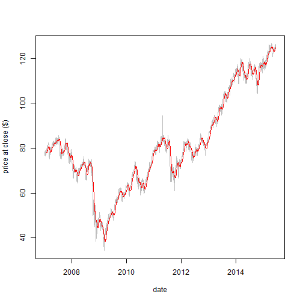

Stock Price History with Running Average
========================================================
author: F. Novak
date: June 2015

Purpose
========================================================

- Retrieve stock price history for the (hard coded) stock symbol
- Add a column with the date and a column with the running average of the closing price
- Plot the closing price (grey) and running average (red)
- Allow modification of days in running average using slider bar

Easy to use
========================================================
* Launch app and the time history of the programmed closing stock price will appear, along with the running average of the price.
    https://fgnovak.shinyapps.io/dp_project
* Select/change the number of days in the average with the slider bar, and the new graph appears automatically.
* To launch app locally:
  + Copy ui.R and server.R from Github into working directory
  + Launch app by typing runApp() at the command line  (alternatively, open ui.R or server.R and hit "Run App" button)

Default result
========================================================

 
- The number of days in the average is adjustable with slider provided

Planned features for future revisions
========================================================
- Provide Ability to select a symbol in lieu of hard coded symbol
- Provide ability to select up to 2 symbols
- Plot vertical lines at dates when moving average crosses data
